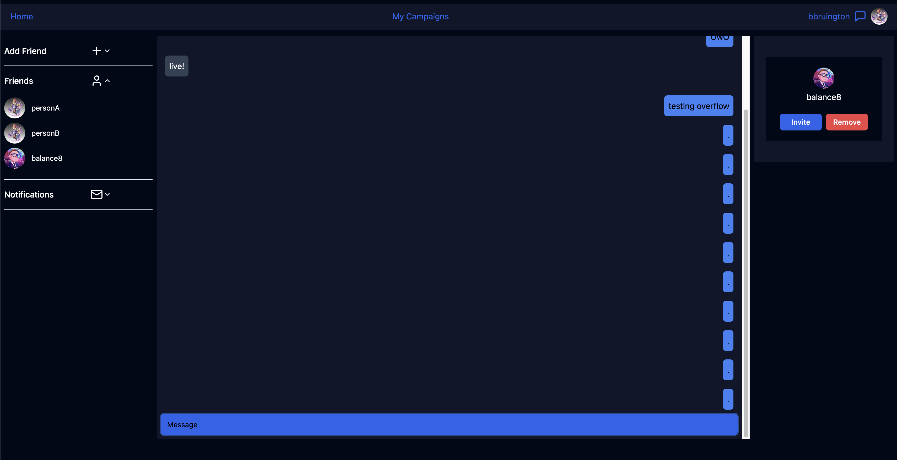

# Quest Bazaar

This is a Dungeons and Dragons social media app.

## What are the features of this app?

Quest Bazaar allows you to connect with fellow lovers of D&D to quickly find / advertise a game and start playing. You're able to chat, 
schedule games, and make characters once you've found a suitable game.

This application was built using the following stack: 

- [Next.js](https://nextjs.org)
- [Clerk.js](https://clerk.com/)
- [Prisma](https://prisma.io)
- [Tailwind CSS](https://tailwindcss.com)
- [tRPC](https://trpc.io)

## Connect with Friends

You can easily connect with others, message each other, and invite them to games to play with!

## Make your own game

You can start and host your own D&D game and conveniently invite anyone you're already friends with!

## Expose your game to other people

You can create a post to advertise your game to catch the eye of users to ask to join your game!

## Set up a time to play

Schedule dates for you and your friends to do events and remember to play!

